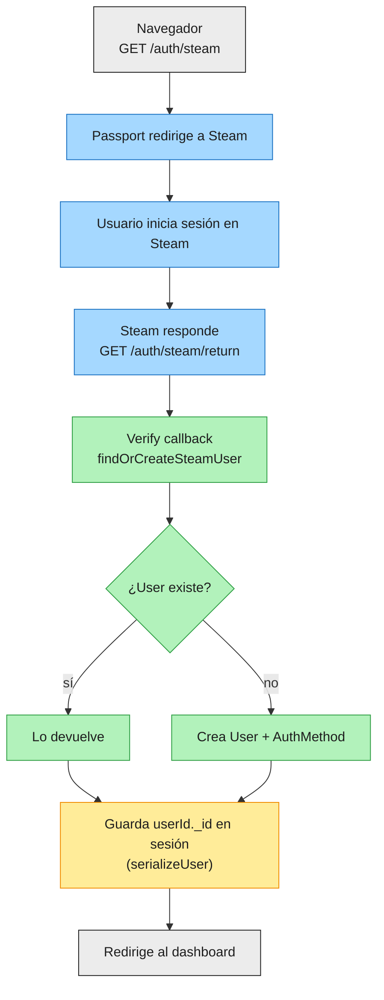

# Flujo de autenticación con Steam

> Documenta **cómo** funciona el login con Steam.
> Refleja la implementación descrita de las decisiones tomadas en [`ADR - AuthMethod separate collection`](../adr/0001-auth-method-separate-collection.md).
> **Fecha**: 2026-08-12

## Diagrama

## Paso a paso

1. **Navegador → `GET /auth/steam`** — el usuario pulsa el botón de login con Steam
2. **Passport redirige a Steam** — `passport.authenticate('steam-openid')` construye la URL de OpenID y redirige
3. **Steam** — el usuario inicia sesión en la propia web de Steam (fuera de la app)
4. **Steam responde → `GET /auth/steam/return`** — Steam redirige de vuelta con la respuesta OpenID firmada
5. **Verify callback → `findOrCreateSteamUser`** — el callback de `SteamOpenIdStrategy` (en `config/passport.ts`) llama a `SteamAuthService.findOrCreateSteamUser(steamId, personaname)`
6. **Según exista o no el `AuthMethod`:**
   - **Existe** → `AuthMethod.findOne(...).populate('userId')` devuelve el `User` ya vinculado
   - **No existe** → se crea `User` + `AuthMethod` juntos, en una transacción de Mongoose (ver `0002-auth-method-separate-collection.md`)
7. **`serializeUser`** — Passport guarda `user._id` en la cookie de sesión
8. **Redirige a la app** — el usuario ya está autenticado; en requests posteriores, `deserializeUser` recupera el `User` completo a partir del `_id` guardado.

## Codebase

| Paso | Archivo |
|---|---|
| Rutas | `src/routes/auth.ts` |
| Configuración passport + serialize/deserialize | `src/config/passport.ts` |
| Lógica de negocio (buscar/crear usuario) | `src/services/steam/SteamAuthService.ts` |
| Modelos | `src/models/User.ts`, `src/models/AuthMethod.ts` |

---
